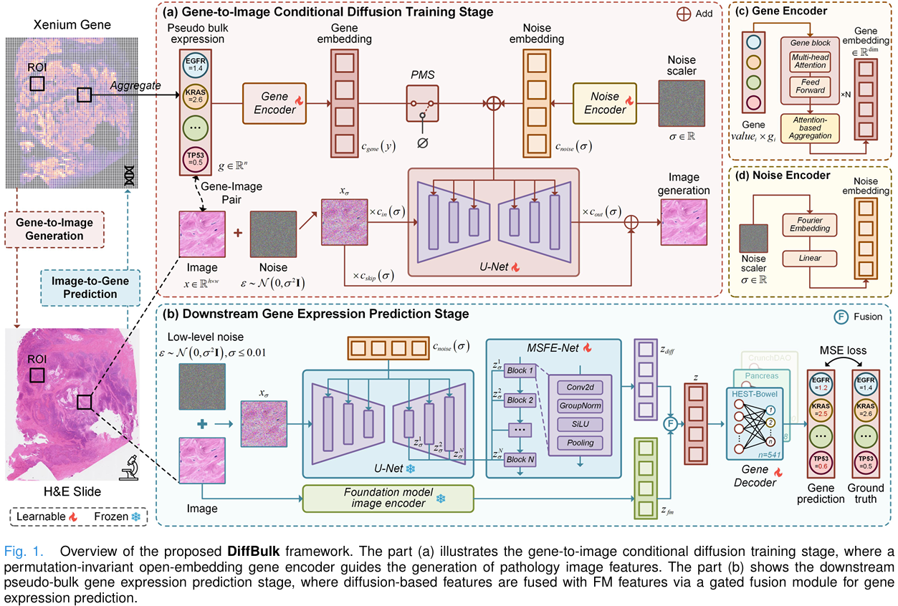

# DiffBulk: Enhancing Spatial Transcriptomic Prediction with Diffusion-Based Training
DiffBulk introduces a two-stage framework for learning gene-aware histology image representations via conditional diffusion modeling.
The model first pretrains a diffusion network conditioned on gene expression, then finetunes a lightweight gene-expression prediction branch for downstream spatial transcriptomic tasks.

<p align="center">  </p>

## 🚀 Key Features
- **Two-stage training**:
  - Diffusion-based representation learning
  - Lightweight gene prediction branch with foundation model
- **Multi-dataset training support**

## 📦 Quick Start
**1. Clone the repository**
```bash
git clone https://github.com/Bochong01/DiffBulk.git
cd DiffBulk
```

### 🌀 Stage I: Diffusion Pretraining
Train the conditional diffusion model with multi-dataset patches and gene profiles.
```bash
cd Pretrain

torchrun --standalone --nproc_per_node=2 train.py \
    --outdir="/path/to/your/outputs" \
    --patch_path="/path/to/dataset1/train_patch.h5" \
    --patch_path="/path/to/dataset2/train_patch.h5" \
    --patch_path="/path/to/dataset3/train_patch.h5" \
    --gene_path="/path/to/dataset1/train_gene.h5" \
    --gene_path="/path/to/dataset2/train_gene.h5" \
    --gene_path="/path/to/dataset3/train_gene.h5" \
    --valid_patch_path="/path/to/dataset1/valid_patch.h5" \
    --valid_patch_path="/path/to/dataset2/valid_patch.h5" \
    --valid_patch_path="/path/to/dataset3/valid_patch.h5" \
    --valid_gene_path="/path/to/dataset1/valid_gene.h5" \
    --valid_gene_path="/path/to/dataset2/valid_gene.h5" \
    --valid_gene_path="/path/to/dataset3/valid_gene.h5" \
    --embed_dim=256 \
    --num_gene_blocks=2 \
    --preset="gene-img224-xs" \
    --batch_size=1024 \
    --duration=$((2<<20)) \
    --status=$((5<<13)) \
    --snapshot=$((2<<13)) \
    --checkpoint=$((1<<17)) \
    --batch-gpu=8 \
    --valid_interval_nimg=$((1<<17)) \
    --valid_batch_size=64 \
    --p=0.5
```

### 📘 Post-EMA Reconstruction
Extract EMA-smoothed checkpoints for downstream training.
```bash
python reconstruct_phema.py \
    --indir="/path/to/your/outputs" \
    --outdir="/path/to/your/ema/outputs" \
    --outstd=0.10,0.15,0.20
```

### 🔬 Stage II: Downstream Gene Expression Training
**1. Configure `config.yaml`**
- <GENE_DIM>: The number of genes to be detected.
```yaml
# data
train_patch_file: "/path/to/downstream/train_patch.h5"
train_gene_file: "/path/to/downstream/train_gene.h5"
valid_patch_file: "/path/to/downstream/valid_patch.h5"
valid_gene_file: "/path/to/downstream/valid_gene.h5"

# pretrained model
diffusion_path: "/path/to/pretrained/diffusion/ema"

# hyper-parameters
noise_label: 0.1
out_dim: <GENE_DIM>
fusion_method: 'gated_residual'
c: 1.0
c_learnable: True

# training
epochs: 10
device: cuda
batch_size: 32
lr: 0.0001
weight_decay: 0.00001

# logging
tensorboard_dir: "./tensorboard"
checkpoint_dir: "./ckpts"
log_interval: 5
valid_interval: 5
start_valid: 0
```
**2. Start Training**
```bash
cd DiffBulk/Downstream
python train.py --config ./config.yaml
```

### 🧪 Testing
**1. Prepare `test_config.yaml`**
```yaml
# data
test_patch_file: "/path/to/test_patch.h5"
test_gene_file: "/path/to/test_gene.h5"

# pretrained model
diffusion_path: "/path/to/ema"

# ckpt
fusion_net_path: "/path/to/checkpoint_best.pth"

device: cuda
batch_size: 32

# fusion net architecture
noise_label: 0.01
pool_type: "average"
out_dim: <GENE_DIM>
fusion_method: "gated_residual"
c: 1.0
c_learnable: True
```
**2. Run Test Script**
```bash
cd DiffBulk/Downstream

OUTPUT_CSV="./results.csv"
if [[ ! -f "$OUTPUT_CSV" ]]; then
    echo "Config,MAE,MSE,Pearson_Correlation,P_value" > $OUTPUT_CSV
fi

CONFIG_PATH="./test_config.yaml"
if [[ -f "$CONFIG_PATH" ]]; then
    echo "Testing model with config: $CONFIG_PATH"
    python test.py --config_paths "$CONFIG_PATH" --output_csv "$OUTPUT_CSV"
else
    echo "Config file not found: $CONFIG_PATH"
fi

echo "All tests completed. Results saved to $OUTPUT_CSV"
```

### ▶️ Google Colab Demo

We also provide an interactive notebook `DiffBulk_colab.ipynb`, allowing you to try the DiffBulk framework directly in Google Colab without local setup.

**Click below to open the Colab notebook:**

<p align="left"> <a href="https://colab.research.google.com/drive/1M1MOUnfpRbZZzlr6wJZOuW9e6K20B88Q#scrollTo=fxJcLMKMYeDt" target="_blank">  </a> </p>